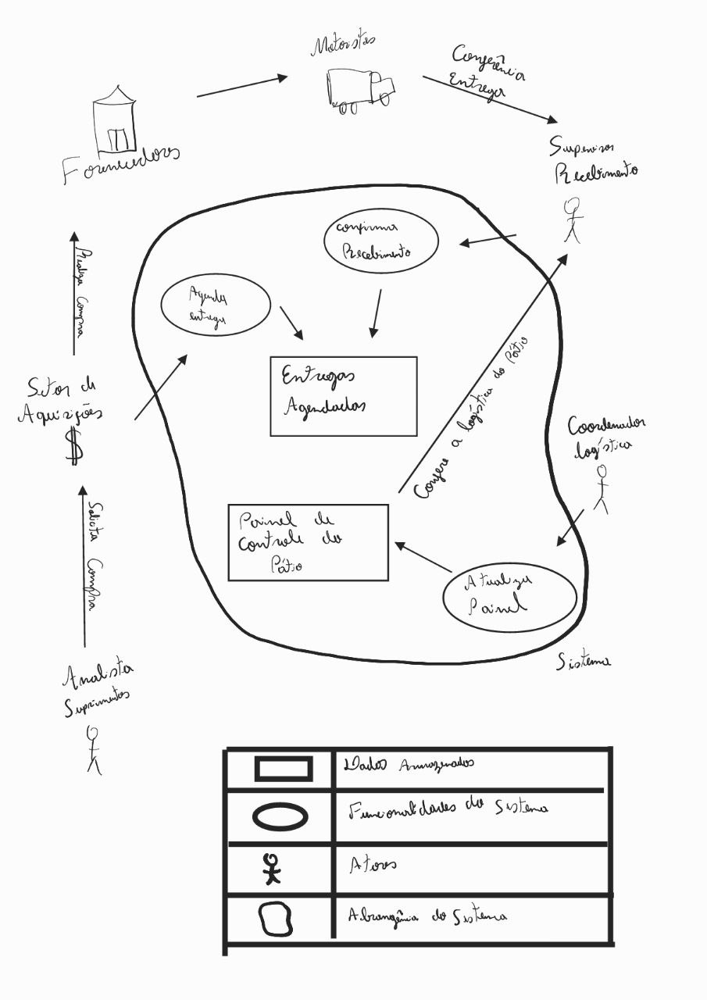

# Rich Picture

## Introdução

O Rich picture é uma ferramenta visual onde a sua ideia esboçar as funcionalidades e características do sistema e a interação dos usuários com estas funcionalidades, de uma maneira mais informal e de fácil compreensão. Abaixo haverá um Rich Picture onde foi esboçado o sistema a ser desenvolvido com base nos relatos de necessidade dos usuários.

## O Rich Picture

Figura 1: Rich Picture.
 
 
 
 

fonte: [Caio Mesquita](https://github.com/Caiomesvie)

